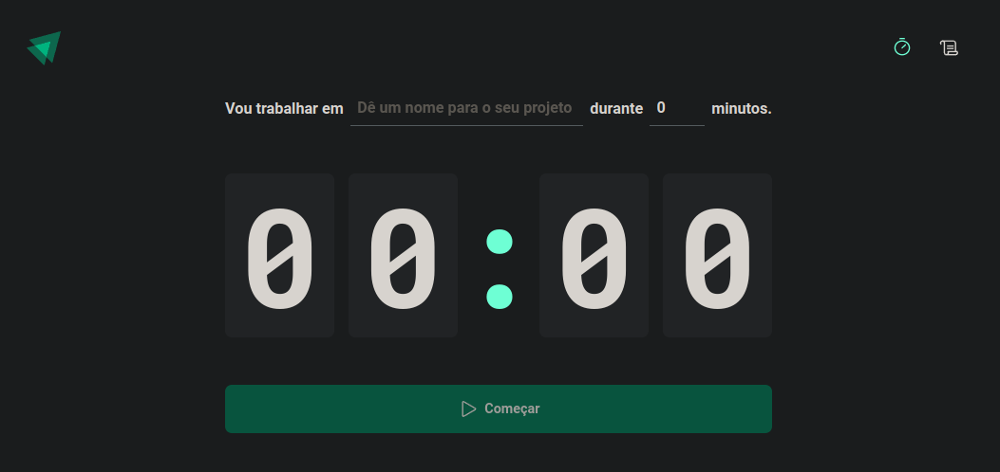
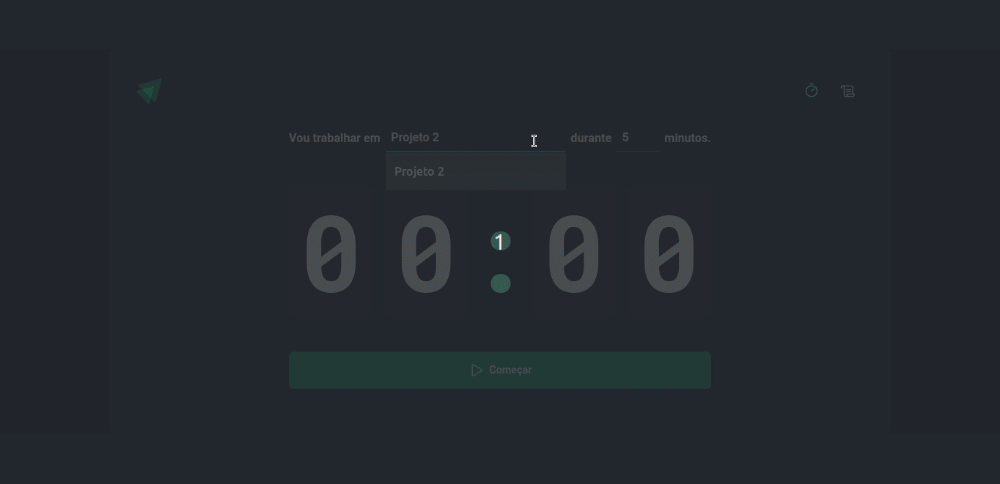

<h1 align="center"></h1>

O History Timer é um projeto com funções semelhantes a um pomodoro. porém com um histórico de uso.

 <a href="#sobre">Sobre</a> •
 <a href="#experiencia">Objetivo</a> •
 <a href="#roteiro">Roteiro</a> • 
 <a href="#tecnologias">Pilha de Tecnologias</a> • 
 <a href="#autor">Autor</a>

<h4 align="center"> 
	✅  Site dinâmico &nbsp; ▶ History Timer.
</h4>

 

  

[Visão Geral](#visao)
===================

## 🛠 [Objetivo](#objetivo)
 
  &nbsp; &nbsp; &nbsp; &nbsp; ▶ &nbsp; O objetivo inicial deste deste projeto é apresentar um sistema semelhante ao pomodoro, que há um cronômetro que está relacionado ao histórico do tempo com as tarefas cronometradas, há também um status. O projeto foi relizado juntamente com os aprendizados obtidos no ignite da Rockeseat, voltado para o desenvolvimento web Front end, com react utilizando typescript.

 

## 📝 [Roteiro](#roteiro)

 

📍 Confira nosso quadro para mais detalhes sobre o que já foi construido.
 

- [x] Armazezamento no LocalStorage
- [x] Cronômetro
- [x] Histórico
- [x] Status
- [x] Descrição da tarefa

📌 Ainda haverá uma nova versão, confira os próximos passos.

-   [ ] próxima versão do History Timer (React, TypeScript, Javascript, Node.Js, MongoDB, API)

## ⛳ [Objetivo](#experiencia)

Este projeto é para fins de estudo, uma pequena aplicação do que aprendi em desenvolvimento web com React usando TypeScript.

    📌 Aplicação de conhecimentos em React com TypeScript
    📌 Histórico de tarefas
    📌 ContextAPI
    📌 Styled Components
    📌 UseReducer
    📌 React Router Dom
    📌 React Hook Form
    📌 useEffect, useState
    📌 zod

Espero que este projeto alcance o objetivo principal que é apresentar minha experiência com Desenvolvedor front-end React TypeScript

 

## 💻 [Tecnologias](#tecnologias)

 

&nbsp;&nbsp;&nbsp;&nbsp; 

&nbsp;&nbsp;&nbsp;&nbsp; 

&nbsp;&nbsp;&nbsp;&nbsp;

&nbsp;&nbsp;&nbsp;&nbsp; 

&nbsp;&nbsp;&nbsp;&nbsp; 

&nbsp;&nbsp;&nbsp;&nbsp; 

&nbsp;&nbsp;&nbsp;&nbsp; 

&nbsp;&nbsp;&nbsp;&nbsp;

&nbsp;&nbsp;&nbsp;&nbsp; 

&nbsp;&nbsp;&nbsp;&nbsp; 

&nbsp;&nbsp;&nbsp;&nbsp; 

 

## 🎬 [A seguir alguns screenshots do projeto History Timer]()

 

  <kbd>
    

  </kbd>

